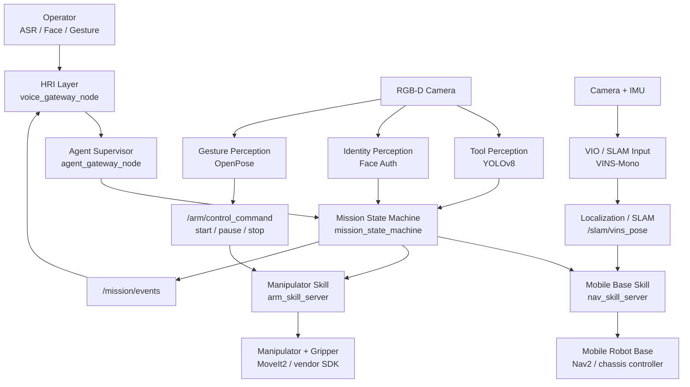
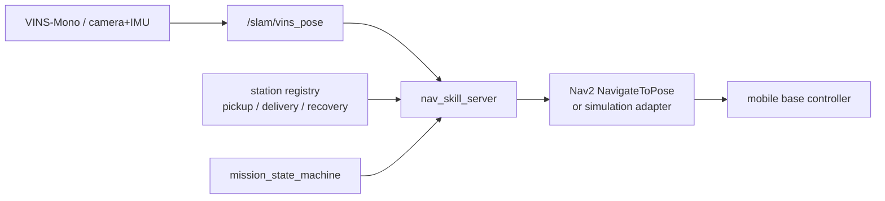
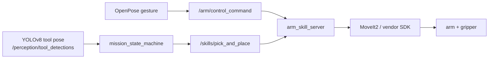
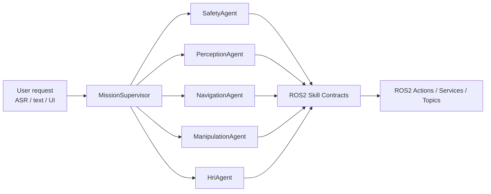
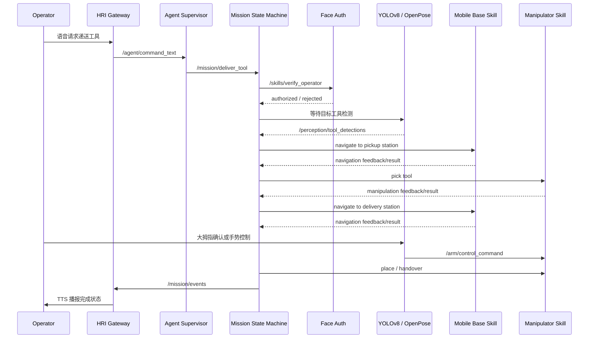

<div align="center">

# ROS2 Multimodal Robot Collaboration

**Agent Supervisor + Mobile Base + Manipulator + Multimodal Perception**


面向实验室/工业工作站场景的多模态机器人协作与工具递送系统。系统把移动小车、机械臂、相机、YOLOv8、OpenPose、人脸识别、VINS-Mono、Nav2、ASR/TTS 和任务级 Agent 调度统一到 ROS2 分布式通信框架中，实现“识别工具、移动取物、机械臂抓取、递送给操作者”的闭环流程。

</div>

## 项目一句话

这是一个由 **Agent Supervisor 负责决策调度**、由 **Mission State Machine 负责确定性执行**、由 **移动小车和机械臂分别完成导航与抓取** 的 ROS2 多模态机器人系统。

简单说：

- Agent Supervisor 是“大脑”：理解任务、检查安全条件、选择要调用的机器人技能。
- Mission State Machine 是“执行链路”：把身份验证、识别、导航、抓取、递送确认按顺序跑完。
- 移动小车是“腿”：负责 SLAM/VIO 定位、Nav2 路径规划、跨区域移动。
- 机械臂是“手”：负责工具抓取、转移、递送、暂停/恢复/急停响应。
- 感知系统是“眼睛和身份检查”：负责 YOLOv8 工具检测、OpenPose 手势识别、人脸验证。
- HRI 是“嘴和耳朵”：通过 ASR/TTS 和操作者沟通任务状态。

## 总体架构



系统不是让一个节点直接控制所有硬件，而是按职责拆开：Agent 只做任务决策和技能选择；状态机负责可靠执行；移动小车和机械臂各自有独立的 Action Server；感知模块通过 Topic/Action 把事实发布给执行层。这样后续替换真实底盘、机械臂 SDK、摄像头或规划器时，不需要推倒整个系统。

## 分层职责

| 层级 | 负责什么 | 对应模块 | 关键 ROS2 接口 |
| --- | --- | --- | --- |
| Agent 总控层 | 解析任务、选择技能、做安全/权限判断、决定是否重试或中止 | `robot_collab_agent`, `agent_harness`, `skills` | `/agent/command_text`, `/system/query_state`, `/mission/deliver_tool` |
| 任务编排层 | 串联完整流程，管理状态、反馈、异常回退 | `robot_collab_core` | `/mission/deliver_tool`, `/mission/events` |
| 移动小车层 | 定位、导航、到达工具区和工作站 | `robot_collab_navigation`, `robot_collab_slam` | `/skills/navigate_to_station`, `/slam/vins_pose` |
| 机械臂层 | 抓取、抬升、转移、放置、递送确认、暂停/恢复/急停 | `robot_collab_manipulation` | `/skills/pick_and_place`, `/arm/control_command` |
| 感知层 | 工具检测、操作者身份验证、手势识别 | `robot_collab_perception` | `/perception/tool_detections`, `/skills/verify_operator`, `/hri/gesture_command` |
| 人机交互层 | ASR 输入、TTS 播报、任务状态反馈 | `robot_collab_hri` | `/hri/asr_text`, `/hri/tts_text`, `/mission/events` |
| 接口层 | 统一 Action/Service/Message 定义 | `robot_collab_interfaces` | `DeliverTool`, `NavigateToStation`, `PickAndPlace`, `VerifyOperator` |
| Bringup 层 | 启动文件、参数、实验配置 | `robot_collab_bringup` | `demo_sim.launch.py`, `perception_yolov8_openpose.launch.py` |

## 移动小车负责什么

移动小车子系统只关心“机器人底盘如何可靠到达某个站点”，不负责机械臂怎么抓，也不负责理解用户意图。



移动小车相关模块：

| 模块 | 职责 |
| --- | --- |
| `vins_mono_bridge_node` | 接入 VINS-Mono 或 ros1_bridge 输出的视觉惯性里程计，发布 `/slam/vins_pose`，给移动小车定位链路使用。 |
| `nav_skill_server` | 对上暴露 `/skills/navigate_to_station` Action，把“去 station_a”转换成 Nav2 或仿真导航目标。 |
| Nav2 / SLAM | 负责地图、定位、路径规划、避障和底盘控制。仓库中预留 adapter，真实部署时接入 `NavigateToPose`。 |
| station config | 管理工具区、递送工作站、恢复点等命名位置，避免上层直接写底盘坐标。 |

移动小车在完整任务里执行两段导航：

1. 从当前区域移动到工具存放区或工作台。
2. 工具抓取完成后移动到目标操作者工作站。

## 机械臂负责什么

机械臂子系统只关心“如何安全地抓取、移动、递送工具”，不负责底盘去哪，也不负责判断用户请求是否合法。



机械臂相关模块：

| 模块 | 职责 |
| --- | --- |
| `arm_skill_server` | 对上暴露 `/skills/pick_and_place` Action，执行抓取、抬升、转移、放置、递送动作。 |
| `/arm/control_command` | 接收 OpenPose 手势转来的控制命令，用于开始、暂停、急停。 |
| MoveIt2 / vendor SDK adapter | 真实部署时把抽象抓取请求转换成机械臂轨迹、末端位姿和夹爪控制。 |
| TF / calibration | 维护相机坐标系、机器人底盘坐标系、机械臂基座坐标系和末端执行器坐标系之间的转换。 |

手势控制直接影响机械臂安全状态：

| 操作者手势 | OpenPose 识别结果 | 机械臂命令 | 行为 |
| --- | --- | --- | --- |
| 握拳 | `fist` | `arm_pause` | 暂停机械臂动作，保留当前任务上下文。 |
| 张开手掌 | `palm` | `system_stop` | 停止当前任务，取消动作，进入安全状态。 |
| 竖起大拇指 | `thumb_up` | `arm_start` | 启动或恢复机械臂工作。 |

## 感知系统怎么配合

感知模块不直接“控制机器人”，而是把环境事实发布给 Agent 和 Mission。

| 感知能力 | 节点 | 输入 | 输出 | 被谁使用 |
| --- | --- | --- | --- | --- |
| 工具检测 | `yolov8_tool_detector_node` | RGB/RGB-D 图像 | `/perception/tool_detections` | Mission、机械臂抓取流程 |
| 人脸验证 | `face_auth_node` | operator id / 人脸特征 | `/skills/verify_operator` Action result | Mission、Agent 安全策略 |
| 手势识别 | `openpose_gesture_node` | 相机图像 | `/hri/gesture_command`, `/arm/control_command` | HRI、机械臂控制 |
| VIO 定位 | `vins_mono_bridge_node` | VINS-Mono odometry | `/slam/vins_pose` | 移动小车导航链路 |

## Agent 和 Multi-Agent 设计

当前工程把 Agent 先落在 `agent_gateway_node` 和 `agent_harness/` 中：它可以接收 ASR 文本或上层任务计划，把任务转换成 ROS2 Action 调用。后续可以拆成多个 Agent，但每个 Agent 只通过 ROS2 skills 调用能力，不直接碰硬件。



| Agent | 关注点 | 调用的 ROS2 能力 |
| --- | --- | --- |
| `MissionSupervisor` | 拆解任务、排序步骤、决定继续/重试/中止 | `/mission/deliver_tool`, `/system/query_state` |
| `SafetyAgent` | 身份、手势、安全状态、急停策略 | `/skills/verify_operator`, `/arm/control_command` |
| `PerceptionAgent` | 工具、操作者、手势等感知结果解释 | `/perception/tool_detections`, `/hri/gesture_command` |
| `NavigationAgent` | 选择目标站点、恢复点、导航策略 | `/skills/navigate_to_station`, `/slam/vins_pose` |
| `ManipulationAgent` | 选择抓取/放置策略、处理夹爪状态 | `/skills/pick_and_place`, `/arm/control_command` |
| `HriAgent` | 任务确认、状态播报、澄清问题 | `/hri/asr_text`, `/hri/tts_text`, `/mission/events` |

## 完整任务怎么跑



异常时的回退逻辑：

- 人脸验证失败：Mission 直接拒绝任务，HRI 播报无权限。
- 工具检测失败：Mission 请求重新检测或进入人工确认。
- 导航失败：移动小车进入恢复点或重试导航。
- 抓取失败：机械臂尝试重新规划抓取，失败后终止任务。
- OpenPose 检测到张开手掌：立即发布 `system_stop`，机械臂和任务状态机进入安全状态。

## ROS2 接口速查

| 类型 | 名称 | 谁提供 | 谁调用/订阅 |
| --- | --- | --- | --- |
| Action | `/mission/deliver_tool` | `mission_state_machine` | `agent_gateway_node`, external planner |
| Action | `/skills/verify_operator` | `face_auth_node` | `mission_state_machine`, SafetyAgent |
| Action | `/skills/navigate_to_station` | `nav_skill_server` | `mission_state_machine`, NavigationAgent |
| Action | `/skills/pick_and_place` | `arm_skill_server` | `mission_state_machine`, ManipulationAgent |
| Service | `/system/query_state` | `agent_gateway_node` | Agent harness, monitor tools |
| Topic | `/perception/tool_detections` | `tool_detector_node`, `yolov8_tool_detector_node` | `mission_state_machine`, PerceptionAgent |
| Topic | `/hri/asr_text` | ASR adapter / operator console | `voice_gateway_node` |
| Topic | `/agent/command_text` | `voice_gateway_node` | `agent_gateway_node` |
| Topic | `/hri/tts_text` | `voice_gateway_node`, `agent_gateway_node` | TTS adapter |
| Topic | `/hri/gesture_command` | `openpose_gesture_node` | HRI, Agent |
| Topic | `/arm/control_command` | `openpose_gesture_node` | `arm_skill_server` |
| Topic | `/slam/vins_pose` | `vins_mono_bridge_node` | navigation/localization stack |
| Topic | `/mission/events` | `mission_state_machine` | HRI, monitor, Agent |

## 工程结构

```text
agent_harness/                # Agent 调度 harness: schemas / examples / router scripts
skills/                       # 每个机器人能力的 SKILL.md + schema + examples + scripts
src/
  robot_collab_interfaces/    # ROS2 msg / srv / action definitions
  robot_collab_core/          # mission state machine
  robot_collab_agent/         # Agent Gateway: intent -> ROS2 actions
  robot_collab_navigation/    # mobile base / Nav2 station navigation adapter
  robot_collab_manipulation/  # manipulator + gripper action server
  robot_collab_perception/    # YOLOv8, OpenPose, face auth, tool detector
  robot_collab_slam/          # VINS-Mono bridge for mobile robot localization
  robot_collab_hri/           # ASR/TTS/gesture feedback gateway
  robot_collab_bringup/       # launch files and shared config
third_party/
  ultralytics/                # vendored Ultralytics YOLO source snapshot
  VINS-Mono/                  # vendored VINS-Mono source snapshot
  openpose/                   # vendored CMU OpenPose source snapshot
```

## WSL Gazebo Quick Start

这一节的目标很具体：你在 Windows 上打开 WSL，进入 Ubuntu 22.04，构建项目，然后在 Gazebo 里看见小车，并能用 ROS2 命令让它动起来。

### 0. Fastest Visible Path

Open Windows PowerShell:

```powershell
wsl -d Ubuntu-22.04
```

Inside WSL:

```bash
cd /mnt/f/Downloads/ros2-multimodal-robot-collab-main
```

Check whether ROS2/Gazebo/Nav2 are ready:

```bash
bash scripts/check_ros2_env.sh
```

If the check says ROS2 Humble or packages are missing, install the dependencies in step 2 below, then run the check again.

Build the workspace:

```bash
bash scripts/build_ros2_workspace.sh
```

Open three WSL terminals for the first hands-on test.

Terminal A, launch Gazebo and the robot collaboration stack:

```bash
cd /mnt/f/Downloads/ros2-multimodal-robot-collab-main
bash scripts/run_gazebo_visible_demo.sh
```

Expected result: Gazebo opens with a small mobile robot in a lab scene.

Terminal B, make the robot move for a few seconds:

```bash
cd /mnt/f/Downloads/ros2-multimodal-robot-collab-main
bash scripts/send_motion_test.sh 5
```

Expected result: the robot visibly drives/turns in Gazebo, then stops.

Terminal C, dry-run the Agent/Harness plan:

```bash
cd /mnt/f/Downloads/ros2-multimodal-robot-collab-main
bash scripts/run_agent_plan_dry_run.sh
```

Expected result: the harness prints the ROS2 Action/Topic calls it would dispatch, including `/skills/verify_operator` and `/mission/deliver_tool`.

With Terminal A still running, execute the checked-in plan against the live ROS2 graph:

```bash
bash scripts/execute_agent_plan.sh
```

Expected result: the mission state machine, face auth stub, tool detector stub, navigation skill, arm skill, HRI, and Agent-facing ROS2 contracts all exchange real ROS2 messages. In this first run, navigation still uses the simulated backend unless you launch Nav2 as shown later.

For the Nav2 experiment that should physically drive to a station:

```bash
bash scripts/run_gazebo_visible_demo.sh \
  start_slam:=true \
  start_nav2:=true \
  nav_backend:=nav2
```

Then in another terminal:

```bash
source /opt/ros/humble/setup.bash
source install/setup.bash

ros2 action send_goal /skills/navigate_to_station robot_collab_interfaces/action/NavigateToStation \
  "{station_id: 'station_a', reason: 'visible Nav2 test'}" \
  --feedback
```

This is the first full visible navigation path: station skill -> Nav2 `NavigateToPose` -> Gazebo robot motion.

Recommended target environment:

- Windows 11 + WSL2
- Ubuntu 22.04
- ROS2 Humble
- Gazebo Classic
- Nav2
- Python 3.10, colcon, rosdep

This machine has multiple WSL distros. Use `Ubuntu-22.04` for this ROS2 project. Keep the older `Ubuntu-20.04-ROS1` distro for ROS1 Noetic experiments.

### 1. Enter WSL

From Windows PowerShell:

```powershell
wsl -d Ubuntu-22.04
```

Inside WSL:

```bash
cat /etc/os-release
```

You want Ubuntu 22.04 / Jammy for ROS2 Humble.

### 2. Install ROS2 Humble, Gazebo, and Nav2

```bash
sudo apt update
sudo apt install -y software-properties-common curl gnupg lsb-release
sudo add-apt-repository universe

sudo curl -sSL https://raw.githubusercontent.com/ros/rosdistro/master/ros.key \
  -o /usr/share/keyrings/ros-archive-keyring.gpg

echo "deb [arch=$(dpkg --print-architecture) signed-by=/usr/share/keyrings/ros-archive-keyring.gpg] \
http://packages.ros.org/ros2/ubuntu $(. /etc/os-release && echo $UBUNTU_CODENAME) main" | \
sudo tee /etc/apt/sources.list.d/ros2.list > /dev/null

sudo apt update
sudo apt install -y \
  ros-humble-desktop \
  ros-humble-navigation2 \
  ros-humble-nav2-bringup \
  ros-humble-gazebo-ros-pkgs \
  ros-humble-slam-toolbox \
  ros-humble-robot-localization \
  python3-colcon-common-extensions \
  python3-rosdep \
  python3-vcstool \
  python3-pip
```

Initialize rosdep once:

```bash
sudo rosdep init || true
rosdep update
```

Add ROS2 to your shell:

```bash
echo "source /opt/ros/humble/setup.bash" >> ~/.bashrc
source ~/.bashrc
ros2 doctor
```

### 3. Open the workspace

Fastest path for the current Windows checkout:

```bash
cd /mnt/f/Downloads/ros2-multimodal-robot-collab-main
```

Building on `/mnt/f` is convenient but slower. For heavier Gazebo/Nav2 work, copy or clone into the WSL ext4 filesystem:

```bash
mkdir -p ~/work
rsync -a --exclude build --exclude install --exclude log \
  /mnt/f/Downloads/ros2-multimodal-robot-collab-main/ \
  ~/work/ros2-multimodal-robot-collab-main/
cd ~/work/ros2-multimodal-robot-collab-main
```

### 4. Build only `src`

The `third_party/` directory contains source snapshots such as VINS-Mono and OpenPose. Do not let colcon build those by default.

```bash
source /opt/ros/humble/setup.bash
rosdep install --from-paths src -y --ignore-src
colcon build --symlink-install --base-paths src
source install/setup.bash
```

### 5. Run the original API simulation

This validates the ROS2 Actions, Services, Topics, Agent gateway, mission state machine, perception stubs, and arm/navigation stubs.

```bash
ros2 launch robot_collab_bringup demo_sim.launch.py
```

In a second WSL terminal:

```bash
cd /mnt/f/Downloads/ros2-multimodal-robot-collab-main
source /opt/ros/humble/setup.bash
source install/setup.bash

ros2 topic pub --once /hri/asr_text std_msgs/msg/String \
  "{data: 'deliver hex_key_3mm to station_a for operator_001'}"
```

### 6. Run the Gazebo visible robot demo

This launches a Gazebo lab, a differential-drive mobile base, the mission stack, the Agent gateway, and a VINS pose bridge. The first Gazebo demo routes Gazebo `/odom` into `/slam/vins_pose` as a stand-in before real VINS-Mono is connected.

```bash
ros2 launch robot_collab_bringup gazebo_nav_vins_demo.launch.py
```

If Gazebo opens but rendering is broken under WSLg:

```bash
export LIBGL_ALWAYS_SOFTWARE=1
ros2 launch robot_collab_bringup gazebo_nav_vins_demo.launch.py
```

To prove the robot can physically move in Gazebo before Nav2 is fully wired:

```bash
ros2 topic pub --rate 10 /cmd_vel geometry_msgs/msg/Twist \
  "{linear: {x: 0.20}, angular: {z: 0.25}}"
```

Stop that publisher with `Ctrl-C`.

### 7. Move toward real Nav2 station navigation

The station-level skill API is stable:

```bash
ros2 action send_goal /skills/navigate_to_station robot_collab_interfaces/action/NavigateToStation \
  "{station_id: 'station_a', reason: 'demo navigation'}" \
  --feedback
```

By default it uses `backend:=simulated`. To start Slam Toolbox, Nav2, and the ROS2 station-navigation backend together:

```bash
ros2 launch robot_collab_bringup gazebo_nav_vins_demo.launch.py \
  start_slam:=true \
  start_nav2:=true \
  nav_backend:=nav2
```

Then `/skills/navigate_to_station` resolves `station_a` from `src/robot_collab_bringup/config/stations.yaml` and dispatches Nav2 `NavigateToPose`.

### 8. Agent harness example

Before a live ROS2 graph is available, inspect what a structured mission plan would dispatch:

```bash
python3 agent_harness/scripts/skill_router.py agent_harness/examples/deliver_hex_key_plan.json
```

The real executor supports dry-run and live ROS2 dispatch:

```bash
python3 agent_harness/scripts/ros_tool_executor.py \
  agent_harness/examples/deliver_hex_key_plan.json

python3 agent_harness/scripts/ros_tool_executor.py \
  agent_harness/examples/deliver_hex_key_plan.json \
  --mode execute \
  --timeout-sec 120
```

Use dry-run on Windows or before sourcing ROS2. Use `--mode execute` inside WSL after launching the ROS2 graph and sourcing both `/opt/ros/humble/setup.bash` and `install/setup.bash`.

To use MiniMax M3 as the planner, keep credentials outside git:

```bash
cp .env.example .env
# edit .env locally and set MINIMAX_API_KEY
```

For the mainland MiniMax console, keep `MINIMAX_BASE_URL` pointed at the URL shown in your console. Common OpenAI-compatible mainland values are `https://api.minimax.chat/v1` and `https://api.minimaxi.com/v1`.

Generate a mission plan from natural language and immediately inspect the ROS2 calls it would make:

```bash
python3 agent_harness/scripts/minimax_mission_planner.py \
  "deliver the 3mm hex key to station_a for operator_001" \
  --output agent_harness/generated/last_plan.json \
  --dry-run
```

Then execute the generated plan once the ROS2 graph is running:

```bash
python3 agent_harness/scripts/ros_tool_executor.py \
  agent_harness/generated/last_plan.json \
  --mode execute \
  --timeout-sec 120
```

## Legacy Quick Start

Target environment:

- Ubuntu 22.04
- ROS2 Humble
- Python 3.10
- colcon / rosdep

```bash
sudo apt update
sudo apt install -y ros-humble-desktop python3-colcon-common-extensions python3-rosdep

cd ros2-multimodal-robot-collab
rosdep update
rosdep install --from-paths src -y --ignore-src
colcon build --symlink-install
source install/setup.bash
```

启动完整模拟闭环：

```bash
ros2 launch robot_collab_bringup demo_sim.launch.py
```

启动 YOLOv8 + OpenPose 感知链路：

```bash
ros2 launch robot_collab_bringup perception_yolov8_openpose.launch.py
```

发送工具递送任务：

```bash
ros2 action send_goal /mission/deliver_tool robot_collab_interfaces/action/DeliverTool \
  "{tool_id: 'hex_key_3mm', target_station: 'station_a', operator_id: 'operator_001', require_confirmation: true}" \
  --feedback
```

通过 ASR/Agent 入口发起任务：

```bash
ros2 topic pub --once /hri/asr_text std_msgs/msg/String \
  "{data: 'deliver hex_key_3mm to station_a for operator_001'}"
```

运行 Agent harness 示例：

```bash
python3 agent_harness/scripts/skill_router.py agent_harness/examples/deliver_hex_key_plan.json
```

## Third-Party Source

第三方源码已作为 vendored source snapshot 放在 `third_party/`，不是子模块链接。对应许可证和来源见 [THIRD_PARTY.md](THIRD_PARTY.md)。

| Component | Path | Role |
| --- | --- | --- |
| Ultralytics YOLO | `third_party/ultralytics` | YOLOv8 工具检测 |
| VINS-Mono | `third_party/VINS-Mono` | 移动小车视觉惯性 SLAM/VIO |
| OpenPose | `third_party/openpose` | 手部关键点与手势控制 |

## 实验目标

- 典型工具递送任务闭环耗时：**2-3 分钟**
- 相比人工跨区域取物预计节省：**40%-60%**
- 结构化工作站中工具识别与抓取目标成功率：**85%-90%**
- 导航/抓取等长耗时动作通过 ROS2 Action feedback 持续监控，降低模块阻塞风险。

## Roadmap

- [x] ROS2 接口、节点和 bringup 工程骨架
- [x] Agent Supervisor / Agent Gateway / skill harness
- [x] YOLOv8 工具检测 adapter
- [x] OpenPose 手势识别 adapter
- [x] 人脸验证 Action server
- [x] VINS-Mono ROS2 bridge
- [x] 机械臂 start / pause / stop 手势控制
- [ ] 接入真实 Nav2 `NavigateToPose`
- [ ] 接入真实 MoveIt2 或厂商机械臂 SDK
- [ ] 完成 RGB-D 工具位姿估计和 camera-base-arm TF 标定
- [ ] 录制 rosbag 数据集做感知/调度回归测试

## License

Root project code is released under MIT. Third-party source directories keep their original licenses.
