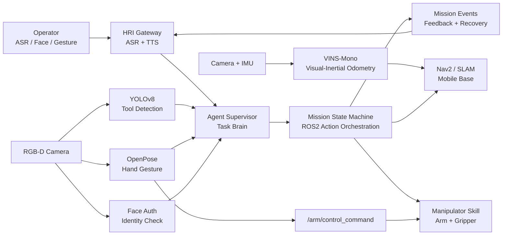

<div align="center">

# ROS2 Multimodal Robot Collaboration

**Agent-driven mobile robot + manipulator collaboration system for tool delivery**


面向实验室/工业工作站的多模态机器人协作系统。
系统以 **Agent Supervisor** 作为任务大脑，统一调度移动小车、机械臂、相机、YOLOv8、OpenPose、人脸识别、VINS-Mono、Nav2、ASR/TTS 和 ROS2 Action/Service/Topic 通信链路，实现工具定位、移动取物、抓取转移与人机协作递送。

</div>

## 项目定位

这个仓库不是单节点 demo，而是一个完整的机器人系统工程骨架：移动底盘负责跨区域导航，机械臂负责抓取和递送，视觉模块负责工具/手势/身份感知，VINS-Mono 为移动小车提供视觉惯性定位输入，Agent Supervisor 负责把所有 ROS2 能力组织成可执行任务链。

典型任务链：

```text
语音/手势请求
  -> Agent Supervisor 解析意图
  -> 人脸识别验证操作者
  -> YOLOv8 定位工具
  -> VINS-Mono/Nav2 确定移动路线
  -> 移动小车到达工具区域
  -> 机械臂抓取工具
  -> 移动小车前往目标工作站
  -> OpenPose 手势确认/暂停/停止
  -> 机械臂递送并完成任务
```

## Agent 总控架构



Agent Supervisor 的职责：

- 把自然语言、ASR 文本、手势和系统状态转成结构化任务计划。
- 根据人脸验证结果决定是否允许机器人移动和机械臂动作。
- 根据 YOLOv8 工具检测结果选择抓取目标。
- 根据 VINS-Mono/Nav2 状态判断移动小车是否可以执行导航。
- 在 OpenPose 检测到握拳/手掌/拇指时执行暂停、急停、启动。
- 用 ROS2 Action 监控导航/抓取长耗时任务，并根据反馈做重试、取消或安全回退。

## 核心能力

- **移动机器人导航**：通过 Nav2 风格 Action wrapper 连接 station-level navigation。
- **机械臂抓取递送**：通过 `/skills/pick_and_place` 管理抓取、抬升、转移、放置。
- **YOLOv8 工具检测**：`yolov8_tool_detector_node` 将检测框映射为 `ToolDetection`。
- **OpenPose 手势控制**：`openpose_gesture_node` 使用手部关键点识别握拳、手掌和拇指。
- **人脸身份验证**：`face_auth_node` 提供 `/skills/verify_operator` 授权 Action。
- **VINS-Mono 视觉惯性定位**：`vins_mono_bridge_node` 将 VIO odometry 转成 `/slam/vins_pose`。
- **Agent Harness**：`agent_harness/` 和 `skills/` 提供 schema、example、scripts，支持任务计划、技能调用和调试。
- **ROS2 分布式通信**：Topic、Service、Action 三种通信方式分别承载感知流、状态查询和长耗时动作。

## 手势控制语义

| OpenPose 手势 | ROS2 Command | 机器人行为 |
| --- | --- | --- |
| 握拳 | `arm_pause` | 暂停机械臂动作，保持任务上下文 |
| 张开手掌 | `system_stop` | 急停/停止任务，取消当前 Action，进入安全状态 |
| 竖起大拇指 | `arm_start` | 启动或恢复机械臂工作 |

## ROS2 接口

| Type | Name | Purpose |
| --- | --- | --- |
| Action | `/mission/deliver_tool` | 完整工具递送任务 |
| Action | `/skills/verify_operator` | 人脸/操作者身份验证 |
| Action | `/skills/navigate_to_station` | 移动小车前往指定站点 |
| Action | `/skills/pick_and_place` | 机械臂抓取、转移、放置 |
| Service | `/system/query_state` | 查询任务状态、节点状态和告警 |
| Topic | `/perception/tool_detections` | YOLOv8 工具检测结果 |
| Topic | `/hri/asr_text` | ASR 文本输入 |
| Topic | `/hri/tts_text` | TTS 播报输出 |
| Topic | `/hri/gesture_command` | OpenPose 手势事件 |
| Topic | `/arm/control_command` | 手势转机械臂控制命令 |
| Topic | `/slam/vins_pose` | VINS-Mono 位姿输出 |
| Topic | `/mission/events` | 任务进度、状态与异常反馈 |

## 工程结构

```text
agent_harness/                # Agent 调度 harness: schemas / examples / router scripts
skills/                       # 每个机器人能力的 SKILL.md + schema + examples + scripts
src/
  robot_collab_interfaces/    # ROS2 msg / srv / action
  robot_collab_core/          # mission state machine
  robot_collab_agent/         # Agent Gateway: intent -> ROS2 actions
  robot_collab_navigation/    # Nav2 station navigation adapter
  robot_collab_manipulation/  # arm + gripper adapter with gesture control
  robot_collab_perception/    # YOLOv8, OpenPose, face auth, tool detector
  robot_collab_slam/          # VINS-Mono bridge for mobile robot localization
  robot_collab_hri/           # ASR/TTS/gesture feedback gateway
  robot_collab_bringup/       # launch and config
third_party/
  ultralytics/                # vendored Ultralytics YOLO source snapshot
  VINS-Mono/                  # vendored VINS-Mono source snapshot
  openpose/                   # vendored CMU OpenPose source snapshot
```

## Quick Start

Target environment:

- Ubuntu 22.04
- ROS2 Humble
- Python 3.10
- colcon / rosdep

```bash
sudo apt update
sudo apt install -y ros-humble-desktop python3-colcon-common-extensions python3-rosdep

cd ros2-multimodal-robot-collab
rosdep update
rosdep install --from-paths src -y --ignore-src
colcon build --symlink-install
source install/setup.bash
```

启动模拟闭环：

```bash
ros2 launch robot_collab_bringup demo_sim.launch.py
```

启动 YOLOv8 + OpenPose 感知链路：

```bash
ros2 launch robot_collab_bringup perception_yolov8_openpose.launch.py
```

发送工具递送任务：

```bash
ros2 action send_goal /mission/deliver_tool robot_collab_interfaces/action/DeliverTool \
  "{tool_id: 'hex_key_3mm', target_station: 'station_a', operator_id: 'operator_001', require_confirmation: true}" \
  --feedback
```

通过 ASR/Agent 入口发起任务：

```bash
ros2 topic pub --once /hri/asr_text std_msgs/msg/String \
  "{data: 'deliver hex_key_3mm to station_a for operator_001'}"
```

运行 Agent harness 示例：

```bash
python3 agent_harness/scripts/skill_router.py agent_harness/examples/deliver_hex_key_plan.json
```

## Third-Party Source

第三方源码已作为 vendored source snapshot 放在 `third_party/`，不是子模块链接。对应许可证和来源见 [THIRD_PARTY.md](THIRD_PARTY.md)。

| Component | Path | Role |
| --- | --- | --- |
| Ultralytics YOLO | `third_party/ultralytics` | YOLOv8 工具检测 |
| VINS-Mono | `third_party/VINS-Mono` | 移动小车视觉惯性 SLAM/VIO |
| OpenPose | `third_party/openpose` | 手部关键点与手势控制 |

## 实验目标

- 典型工具递送任务闭环耗时：**2-3 分钟**
- 相比人工跨区域取物预计节省：**40%-60%**
- 结构化工作站中工具识别与抓取目标成功率：**85%-90%**
- 导航/抓取等长耗时动作通过 ROS2 Action feedback 持续监控，降低模块阻塞风险。

## Roadmap

- [x] ROS2 接口、节点和 bringup 工程骨架
- [x] Agent Supervisor / Agent Gateway / skill harness
- [x] YOLOv8 工具检测 adapter
- [x] OpenPose 手势识别 adapter
- [x] 人脸验证 Action server
- [x] VINS-Mono ROS2 bridge
- [x] 机械臂 start / pause / stop 手势控制
- [ ] 接入真实 Nav2 `NavigateToPose`
- [ ] 接入真实 MoveIt2 或厂商机械臂 SDK
- [ ] 完成 RGB-D 工具位姿估计和 camera-base-arm TF 标定
- [ ] 录制 rosbag 数据集做感知/调度回归测试

## License

Root project code is released under MIT. Third-party source directories keep their original licenses.
