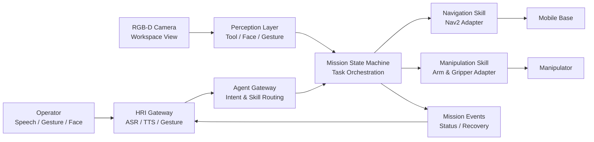

<div align="center">

# ROS2 Multimodal Robot Collaboration

**移动机器人 × 机械臂 × 视觉感知 × 语音交互 × 任务级协作**


面向实验室和工业工作站场景的多模态机器人协作系统。  
系统通过 ROS2 分布式节点架构，把移动底盘、机械臂、相机、视觉识别、人脸验证、手势/语音交互和任务调度解耦为可替换模块，实现工具定位、移动取物、机械臂抓取与人机协作递送闭环。

</div>

## Project Overview

本项目围绕“工作站工具递送”这一典型场景设计：操作者通过语音或手势发起请求，系统完成身份校验后，在 SLAM/Nav2 地图中规划路径，移动机器人到达工具区域，视觉模块定位目标工具，机械臂完成抓取和转移，最后将工具递送至指定工作站或交互区域。

系统目标不是单一算法 demo，而是一套从感知、定位、导航、抓取到任务编排的完整机器人工作流。当前仓库提供可运行的 ROS2 工程骨架和仿真友好的 Action Server，方便逐步替换为真实传感器、Nav2、MoveIt2 或厂商机械臂 SDK。

## Highlights

- **ROS2 分布式系统架构**：移动机器人、机械臂、感知算法、HRI 和任务调度模块独立封装，通过 Topic、Service、Action 异步协同。
- **任务级状态机**：串联身份验证、目标识别、路径规划、移动导航、机械臂抓取、递送确认等阶段，并预留异常回退逻辑。
- **多模态人机交互**：支持 ASR 文本输入、TTS 状态播报、手势确认/取消，以及人脸身份验证流程。
- **机器人能力 Skill 化**：将导航、识别、抓取、状态查询等 ROS2 能力抽象成稳定接口，便于上层任务规划器调用。
- **可替换硬件适配层**：当前节点可在无实体机器人环境中跑通流程，后续可替换为 Nav2、MoveIt2、YOLO/OpenCV、MediaPipe、FunASR/TTS 等真实模块。

## System Architecture



## Workspace Layout

```text
src/
  robot_collab_interfaces/    # msg / srv / action interface definitions
  robot_collab_core/          # delivery mission state machine
  robot_collab_navigation/    # station-level navigation skill server
  robot_collab_manipulation/  # pick-and-place manipulation skill server
  robot_collab_perception/    # tool detection, face auth, gesture stubs
  robot_collab_hri/           # ASR/TTS/gesture gateway
  robot_collab_agent/         # command parser and skill dispatch gateway
  robot_collab_bringup/       # launch files and shared config
skills/                       # capability cards for task-level planning
docs/                         # architecture notes and development roadmap
```

## ROS2 Interfaces

| Type | Name | Purpose |
| --- | --- | --- |
| Action | `/mission/deliver_tool` | Full tool delivery mission |
| Action | `/skills/verify_operator` | Face/operator authorization |
| Action | `/skills/navigate_to_station` | Station-level mobile base navigation |
| Action | `/skills/pick_and_place` | Tool grasp, transfer, and placement |
| Service | `/system/query_state` | Mission status and system health query |
| Topic | `/perception/tool_detections` | Tool pose and confidence stream |
| Topic | `/hri/asr_text` | ASR text input |
| Topic | `/hri/tts_text` | TTS text output |
| Topic | `/hri/gesture_command` | Gesture command stream |
| Topic | `/mission/events` | Mission progress and event stream |

## Quick Start

Target environment:

- Ubuntu 22.04
- ROS2 Humble
- Python 3.10
- colcon / rosdep

```bash
sudo apt update
sudo apt install -y ros-humble-desktop python3-colcon-common-extensions python3-rosdep

cd ros2-multimodal-robot-collab
rosdep update
rosdep install --from-paths src -y --ignore-src
colcon build --symlink-install
source install/setup.bash
```

Start the simulated full workflow:

```bash
ros2 launch robot_collab_bringup demo_sim.launch.py
```

Send a delivery mission directly:

```bash
ros2 action send_goal /mission/deliver_tool robot_collab_interfaces/action/DeliverTool \
  "{tool_id: 'hex_key_3mm', target_station: 'station_a', operator_id: 'operator_001', require_confirmation: true}" \
  --feedback
```

Or publish an ASR-style command through the HRI/Agent gateway:

```bash
ros2 topic pub --once /hri/asr_text std_msgs/msg/String \
  "{data: 'deliver hex_key_3mm to station_a for operator_001'}"
```

## Demo Scenario

| Stage | Module | Expected Behavior |
| --- | --- | --- |
| 1 | HRI Gateway | Receives speech text or gesture command |
| 2 | Agent Gateway | Parses delivery intent and dispatches mission |
| 3 | Face Auth | Checks operator id against authorization list |
| 4 | Tool Detection | Publishes target tool pose and confidence |
| 5 | Navigation | Moves robot to pickup station and delivery station |
| 6 | Manipulation | Executes pick, lift, transfer, and place sequence |
| 7 | Mission Events | Streams progress to TTS and status monitor |

## Experimental Notes

The initial system design targets structured laboratory/workstation scenes:

- typical closed-loop task time: **2-3 minutes**
- expected time reduction compared with manual cross-area retrieval: **40%-60%**
- structured-scene tool recognition and grasp success target: **85%-90%**
- long-running navigation/manipulation operations are tracked through ROS2 Action feedback and result states

These metrics are intended as the baseline for lab validation. Real hardware results depend on camera placement, calibration quality, tool geometry, station layout, and navigation map quality.

## Capability Cards

The `skills/` directory documents each robot capability as a small, stable contract:

- `mission-control`: complete tool delivery mission
- `navigation`: move to named stations or recovery waypoints
- `perception`: tool detection, identity verification, gesture interpretation
- `manipulation`: pick, transfer, place, and handover
- `hri`: ASR/TTS interaction and confirmation handling
- `system-state`: query mission state, warnings, and node availability

This makes the system easier to extend from deterministic state-machine control to task-level planning while keeping the ROS2 runtime interfaces stable.

## Development Roadmap

- [x] Define ROS2 package boundaries and interface contracts
- [x] Implement simulation-friendly Action servers for the full delivery loop
- [x] Add HRI bridge for ASR/TTS text and gesture commands
- [x] Add Agent gateway and skill documentation
- [ ] Connect Nav2 `NavigateToPose` with station registry
- [ ] Replace tool detector stub with OpenCV/YOLO pipeline
- [ ] Integrate MoveIt2 or vendor SDK for the manipulator
- [ ] Add camera-base-arm TF calibration workflow
- [ ] Add rosbag-based regression tests for perception and mission replay
- [ ] Extend to multi-robot task allocation and shared workstation scheduling

## Repository Description

Recommended GitHub description:

```text
ROS2 multimodal robot collaboration system for tool detection, SLAM/Nav2 navigation, arm grasping, face/gesture/voice HRI, and task-level delivery orchestration.
```

## License

MIT License.
