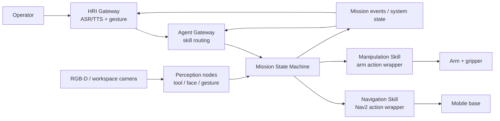

# ROS2 Multimodal Robot Collaboration

面向实验室/工业工作站的 ROS2 移动机器人与机械臂协作系统。系统融合 SLAM/Nav2 导航、视觉工具识别、人脸身份验证、手势/语音交互、机械臂抓取和任务级状态机，实现“识别操作者 -> 定位工具 -> 移动取物 -> 抓取 -> 递送确认”的闭环。

This repository is intentionally structured as an extensible ROS2 workspace plus an Agent skill layer. The current implementation provides simulation-friendly action servers and replaceable adapters, so real hardware drivers can be integrated incrementally.

## Architecture



## Repository Layout

```text
src/
  robot_collab_interfaces/    # ROS2 msg/srv/action contracts
  robot_collab_core/          # mission state machine and task orchestration
  robot_collab_navigation/    # Nav2-facing action wrapper, simulation stub
  robot_collab_manipulation/  # arm/gripper action wrapper, simulation stub
  robot_collab_perception/    # tool detection, face auth, gesture stubs
  robot_collab_hri/           # ASR/TTS/gesture gateway
  robot_collab_agent/         # LLM/VLM-facing skill gateway
  robot_collab_bringup/       # launch files and shared config
skills/                       # Agent skill descriptions for ROS2 capabilities
docs/                         # architecture, roadmap, integration notes
```

## Quick Start

Target platform: Ubuntu 22.04 + ROS2 Humble.

```bash
sudo apt update
sudo apt install -y ros-humble-desktop python3-colcon-common-extensions

cd ros2_multimodal_robot_collab
rosdep update
rosdep install --from-paths src -y --ignore-src
colcon build --symlink-install
source install/setup.bash
ros2 launch robot_collab_bringup demo_sim.launch.py
```

Trigger a simulated delivery:

```bash
ros2 action send_goal /mission/deliver_tool robot_collab_interfaces/action/DeliverTool \
  "{tool_id: 'hex_key_3mm', target_station: 'station_a', operator_id: 'operator_001'}" \
  --feedback
```

Or send a natural-language style text command through the Agent/HRI bridge:

```bash
ros2 topic pub --once /hri/asr_text std_msgs/msg/String \
  "{data: 'deliver hex_key_3mm to station_a for operator_001'}"
```

## Integration Path

1. Replace `robot_collab_navigation/nav_skill_server.py` with a Nav2 `NavigateToPose` client.
2. Replace `robot_collab_manipulation/arm_skill_server.py` with MoveIt2 or a vendor SDK adapter.
3. Replace perception stubs with OpenCV/YOLO/MediaPipe/face-recognition pipelines.
4. Connect `robot_collab_hri` to Whisper/Vosk/FunASR and a local TTS engine.
5. Bind `robot_collab_agent` skill schemas to an LLM/VLM planner.

## Current Milestones

- ROS2 package boundaries and interfaces are defined.
- Simulation-friendly action servers are included for delivery, navigation, manipulation, and identity verification.
- HRI and Agent gateways can convert ASR text or gesture commands into mission requests.
- Local skill descriptions describe how a planner should call navigation, perception, manipulation, HRI, and mission-control capabilities.

