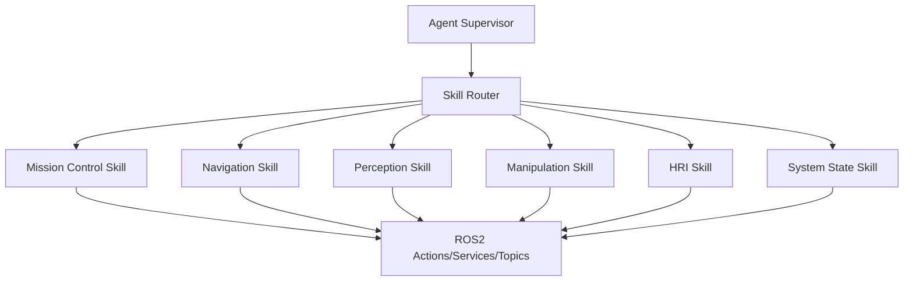

# Agent Skill Harness

The `skills/` directory describes ROS2 capabilities as callable tools for the Agent Supervisor. Each skill now contains:

- `SKILL.md`: usage rules and runtime notes
- `schema.json`: machine-readable arguments and ROS2 endpoint mapping
- `examples/`: concrete task calls
- `scripts/`: small ROS2 helper scripts for manual testing

The `agent_harness/` directory adds full mission-plan schemas, example plans, and a deterministic router script that converts a structured plan into ROS2 commands.

## Skill Routing



## Recommended Mission Plan Contract

Planner output should be structured JSON:

```json
{
  "intent": "deliver_tool",
  "tool_id": "hex_key_3mm",
  "target_station": "station_a",
  "operator_id": "operator_001",
  "confirmation_required": true
}
```

The router should reject plans that omit identity, target station, or tool id unless the HRI skill has already obtained clarification.

Example:

```bash
python3 agent_harness/scripts/skill_router.py agent_harness/examples/deliver_hex_key_plan.json
```

## ASR/TTS Interaction

Recommended HRI loop:

1. ASR publishes raw text to `/hri/asr_text`.
2. `agent_gateway_node` normalizes commands.
3. `MissionSupervisor` requests identity verification before motion.
4. Mission events are converted into concise TTS messages on `/hri/tts_text`.
5. For risky states, the HRI agent asks for confirmation before dispatching a robot or arm action.
