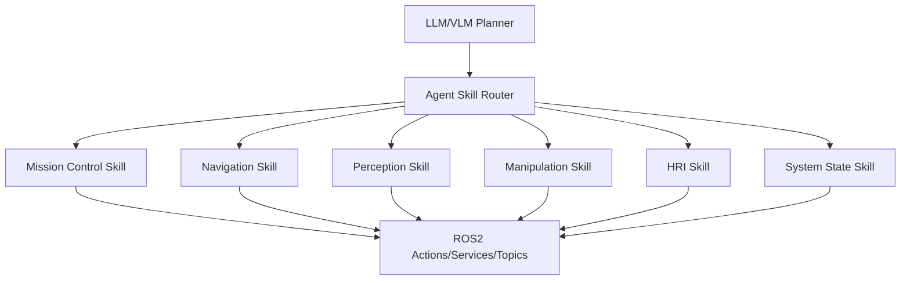

# Agent Skill Layer

The `skills/` directory documents ROS2 capabilities as callable tools for an upper-level LLM/VLM planner. Each skill is intentionally small: it says when to use the capability, which ROS2 API it calls, required arguments, expected feedback, and failure modes.

## Skill Routing



## Recommended Planner Contract

Planner output should be structured JSON:

```json
{
  "intent": "deliver_tool",
  "tool_id": "hex_key_3mm",
  "target_station": "station_a",
  "operator_id": "operator_001",
  "confirmation_required": true
}
```

The router should reject plans that omit identity, target station, or tool id unless the HRI skill has already obtained clarification.

## ASR/TTS Interaction

Recommended HRI loop:

1. ASR publishes raw text to `/hri/asr_text`.
2. `agent_gateway_node` normalizes commands.
3. `MissionSupervisor` requests identity verification before motion.
4. Mission events are converted into concise TTS messages on `/hri/tts_text`.
5. For risky states, the HRI agent asks for confirmation before dispatching a robot or arm action.

