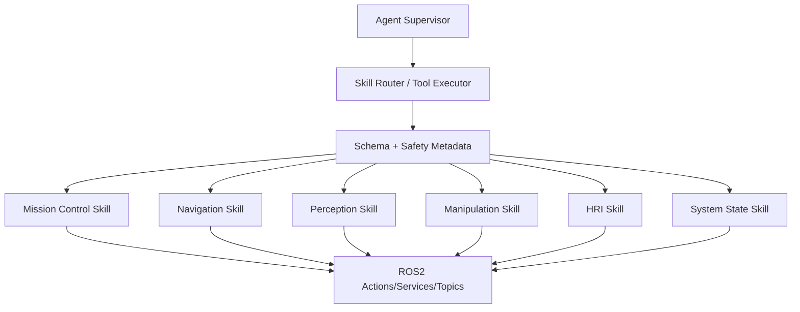

# Agent Skill Harness

The `skills/` directory describes ROS2 capabilities as callable tools for the Agent Supervisor. Each skill now contains:

- `SKILL.md`: usage rules and runtime notes
- `schema.json`: machine-readable arguments and ROS2 endpoint mapping
- `examples/`: concrete task calls
- `scripts/`: small ROS2 helper scripts for manual testing

The `agent_harness/` directory adds full mission-plan schemas, example plans, a dry-run router, and a ROS2 tool executor. The executor is the bridge from LLM/function-calling shaped JSON into ROS2 Actions, Services, and Topics.

## Skill Routing



## Recommended Mission Plan Contract

Planner output should be structured JSON:

```json
{
  "intent": "deliver_tool",
  "tool_id": "hex_key_3mm",
  "target_station": "station_a",
  "operator_id": "operator_001",
  "confirmation_required": true
}
```

The router should reject plans that omit identity, target station, or tool id unless the HRI skill has already obtained clarification.

Example:

```bash
python3 agent_harness/scripts/skill_router.py agent_harness/examples/deliver_hex_key_plan.json
```

The compatibility `skill_router.py` entry point now delegates to `ros_tool_executor.py` in dry-run mode.

## Tool Executor

Dry-run validation works without a sourced ROS2 environment:

```bash
python3 agent_harness/scripts/ros_tool_executor.py \
  agent_harness/examples/deliver_hex_key_plan.json
```

Structured JSON output is useful for an LLM harness or test runner:

```bash
python3 agent_harness/scripts/ros_tool_executor.py \
  agent_harness/examples/emergency_stop_plan.json \
  --json
```

When a ROS2 graph is running, execute the same plan directly through `rclpy`:

```bash
source /opt/ros/humble/setup.bash
source install/setup.bash

python3 agent_harness/scripts/ros_tool_executor.py \
  agent_harness/examples/deliver_hex_key_plan.json \
  --mode execute \
  --timeout-sec 120
```

Execution behavior:

- Actions call `rclpy.action.ActionClient` and collect feedback/result.
- Services call `rclpy` clients and normalize the response.
- Topics publish the generated message a few times to allow discovery.
- Each plan gets a `trace_id` so later logging can connect an LLM decision to ROS2 side effects.

Skill schemas mark whether an action is `callable`, its `risk`, whether it `requires_confirmation`, and a suggested `timeout_sec`. Sensor outputs such as YOLO detections and OpenPose gesture recognition are marked `callable: false`; the agent may observe their topics indirectly, but should not dispatch them as commands.

## ASR/TTS Interaction

Recommended HRI loop:

1. ASR publishes raw text to `/hri/asr_text`.
2. `agent_gateway_node` normalizes commands.
3. `MissionSupervisor` requests identity verification before motion.
4. Mission events are converted into concise TTS messages on `/hri/tts_text`.
5. For risky states, the HRI agent asks for confirmation before dispatching a robot or arm action.
